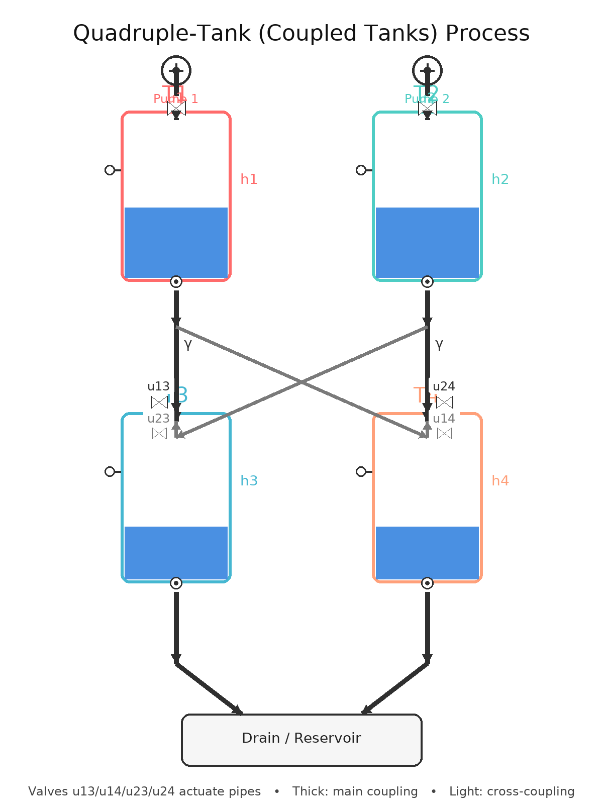

# Quadruple-Tank (Coupled Tanks) Control Project

## Overview

This project implements a nonlinear quadruple-tank system with a pump-based control architecture. Students design and tune PID controllers to regulate four coupled water tanks to independent height setpoints. The system demonstrates fundamental concepts in dynamic systems, control theory, linearization, and experimental validation of frequency-domain designs on nonlinear plants.

## System Description

### Plant Model

The quadruple-tank system consists of:
- **4 Water Tanks** (T1, T2, T3, T4) arranged in a 2×2 grid
- **2 Variable-Flow Pumps** (Pump 1 → Tank 1, Pump 2 → Tank 2)
- **Cross-Coupling Valves** (fixed at 0.7) connecting upper tanks to lower tanks
- **Nonlinear Dynamics** based on mass balance and Torricelli outflow law

**Key Parameters:**
- Tank diameter: 10 cm (area ≈ 78.54 cm²)
- Maximum height: 100 cm
- Pump flow range: [0, 300] cm³/s per pump
- Gravity: 981 cm/s²
- Discharge coefficient: 0.5

### Control Architecture

The pump-based architecture simplifies control by:
1. **Direct pump control**: Pump 1 controls Tank 1, Pump 2 controls Tank 2
2. **Passive coupling**: Tanks 3 and 4 follow via fixed cross-coupling valves
3. **Two PID controllers**: One for each pump (simpler than 4-valve coordination)

**Independent Setpoints:**
- Tank 1: 40 cm (default)
- Tank 2: 60 cm (default)
- Tank 3: 70 cm (default, passively coupled from T1)
- Tank 4: 80 cm (default, passively coupled from T2)

## System Diagram



## Project Structure

```
.
├── README.md                              # This file
├── quadruple_tank_modeling.tex           # LaTeX documentation (system theory)
├── quadruple_tank_modeling.pdf           # Compiled PDF documentation
├── requirements.txt                       # Python dependencies
├── controller.py                          # YOUR CONTROLLER IMPLEMENTATION ⭐
├── run_simulation.py                      # Main entry point for testing
│
├── quadruple_tanks/                      # Core system package
│   ├── __init__.py
│   ├── models/
│   │   ├── quadruple_system.py          # Nonlinear plant model (DO NOT MODIFY)
│   │   ├── tank.py                       # Individual tank dynamics (DO NOT MODIFY)
│   │   └── __init__.py
│   ├── controllers/
│   │   ├── pid_controller.py            # Reference PID (informational)
│   │   ├── simple_controller.py         # Simple baseline (informational)
│   │   └── __init__.py
│   ├── simulation/
│   │   ├── simulator.py                 # Simulation loop (DO NOT MODIFY)
│   │   └── __init__.py
│   ├── animation/
│   │   ├── animator.py                  # Real-time visualization (DO NOT MODIFY)
│   │   └── __init__.py
│   └── utils/
│       ├── helpers.py
│       └── __init__.py
│
├── examples/                              # Example scripts (reference only)
│   ├── basic_control.py
│   ├── detailed_visualization.py
│   ├── gain_tuning.py
│   └── ...
│
└── tests/                                 # Testing scripts
    └── test_quadruple_tanks.py
```

## Getting Started

### 1. Install Dependencies

```bash
pip install -r requirements.txt
```

**Required packages:**
- numpy
- matplotlib
- scipy

### 2. Run the Default Simulation

Test the system with default controller settings:

```bash
python run_simulation.py
```

This will:
- Run a 300-second simulation with 0.1s timestep
- Display real-time visualization of tank levels and pump flows
- Show live scoring based on per-tank settling performance
- Print final score and settlement times

## Student Tasks

### Task 1: Understand the System

**What to do:**
1. Read `quadruple_tank_modeling.pdf` to understand:
   - Nonlinear plant model (Torricelli outflow)
   - Linearization around an operating point
   - State-space and transfer-function forms
   - System coupling and dynamics

2. Study `quadruple_tanks/models/quadruple_system.py` to see:
   - How the nonlinear model is implemented
   - How pump inputs translate to tank dynamics
   - How tanks are coupled through fixed valves

3. Experiment with the provided simulation:
   ```bash
   python run_simulation.py
   ```
   Observe how tank levels respond to the default controller.

### Task 2: Design Your Controller

**What to do:**
Edit `controller.py` and implement a `PumpController` class that:
- **Input:** `setpoint` (target height), `measurement` (current height), `time` (elapsed time)
- **Output:** Pump flow command in range [0, 300] cm³/s
- **Constraints:** Single pump, independent control

**Controller Options:**
1. **PID Controller** (Recommended)
   ```
   u(t) = Kp * e(t) + Ki * ∫e(τ)dτ + Kd * de/dt
   ```
   Tune gains (Kp, Ki, Kd) to achieve fast settling with minimal overshoot

2. **Lead-Lag Compensator** (Advanced)
   Design frequency-domain compensator, then implement as digital filter

3. **Adaptive Control** (Challenge)
   Adapt gains based on operating point or system conditions

### Task 3: Tune Your Gains

**Objectives:**
- Minimize settling time (time to reach steady state)
- Limit overshoot (prevent tank overflow)
- Ensure stability (smooth convergence to setpoint)
- Handle 4-tank coupling disturbances

**Recommended Approach:**
1. **Linearize** around a nominal operating point (e.g., h = 75 cm)
2. **Compute transfer function** using linearized A, B, C, D matrices
3. **Loop-shape** in the frequency domain (Bode plots)
4. **Validate** on the nonlinear plant using `run_simulation.py`

**Tuning Tips:**
- Start with a simple proportional controller (Kp only)
- Add integral gain (Ki) to eliminate steady-state error
- Add derivative gain (Kd) to reduce overshoot
- Use anti-windup to prevent integral saturation at pump limits

### Task 4: Validate on the Nonlinear Plant

**What to do:**
1. Run simulation with your controller:
   ```bash
   python run_simulation.py
   ```

2. Check the real-time visualization:
   - Tank level trajectories (solid lines)
   - Target setpoints (dashed lines, color-matched)
   - Pump flow commands (bottom panel)
   - Live score calculation

3. Analyze the results:
   - Did all tanks settle to their targets?
   - How long did each tank take to settle?
   - Were there any oscillations or overshoot?
   - Did the pump commands exceed [0, 300] cm³/s?

### Task 5: Test with Different Setpoints

**What to do:**
Edit `run_simulation.py` and change the setpoint values:
```python
setpoint1, setpoint2, setpoint3, setpoint4 = 40.0, 60.0, 70.0, 80.0  # Modify these
```

**Test cases to try:**
- **Low setpoints:** 20, 30, 25, 35 (test pump behavior at low flows)
- **High setpoints:** 80, 85, 90, 85 (test saturation limits)
- **Varied:** 30, 70, 40, 80 (asymmetric coupling effects)

**Observations:**
- Does performance degrade at extreme setpoints?
- Are all tanks consistently able to settle?
- How does coupling affect the lower tanks (T3, T4)?

## Scoring System

The control performance is evaluated using a **cumulative per-tank scoring methodology**:

### Scoring Rules

1. **Settlement Criterion:** A tank is considered "settled" if:
   - It reaches within ±5% of its setpoint
   - It remains within the tolerance band for the final 30 seconds

2. **Individual Tank Score:**
   ```
   Tank Score = max(0, 300 - t_settle)
   ```
   where `t_settle` is the time at which the tank first enters its tolerance band

3. **Total Score:**
   ```
   Final Score = Σ(Individual Tank Scores)
   ```
   Maximum possible: 1200 (all 4 tanks settled at t=0)

### Example
If:
- Tank 1 settles at 16.7 seconds → Score = 300 - 16.7 = 283.3
- Tank 2 settles at 30.4 seconds → Score = 300 - 30.4 = 269.6
- Tank 3 does not settle → Score = 0
- Tank 4 does not settle → Score = 0

**Total Score = 283.3 + 269.6 = 552.9 / 1200**

## Important Files to Modify

### `controller.py` ⭐ (Primary - Your Work)

This is where you implement your PID controller:

```python
class PumpController:
    def __init__(self, max_pump_flow=300.0):
        """Initialize your controller parameters."""
        self.Kp = 1.5        # Proportional gain - TUNE THIS
        self.Ki = 0.15       # Integral gain - TUNE THIS
        self.Kd = 0.5        # Derivative gain - TUNE THIS
        self.bias = 250.0    # Bias flow for equilibrium - TUNE THIS
        # ... other initialization ...
    
    def update(self, setpoint, measurement, time):
        """
        Compute pump flow command.
        
        Args:
            setpoint: Target tank height (cm)
            measurement: Current tank height (cm)
            time: Elapsed simulation time (s)
        
        Returns:
            Pump flow command (0 to 300 cm³/s)
        """
        # YOUR CONTROL LAW HERE
        error = setpoint - measurement
        # ... PID computation ...
        return pump_flow
```

### `run_simulation.py` (Secondary - Adjust for Testing)

Modify setpoints and parameters as needed:

```python
# Line ~50: Change setpoints to test different scenarios
setpoint1 = 40.0  # Tank 1 target
setpoint2 = 60.0  # Tank 2 target
setpoint3 = 70.0  # Tank 3 target
setpoint4 = 80.0  # Tank 4 target
```

### DO NOT MODIFY

- `quadruple_tanks/models/quadruple_system.py` — Plant model
- `quadruple_tanks/models/tank.py` — Tank physics
- `quadruple_tanks/simulation/simulator.py` — Simulation loop
- `quadruple_tanks/animation/animator.py` — Visualization

## Troubleshooting

### Issue: Tanks don't settle

**Possible causes:**
- Gains too small (slow response, never reaches setpoint)
- Integral gain too low (steady-state error)
- Proportional gain too high (oscillation)

**Solution:**
1. Increase Kp gradually and test
2. Add or increase Ki to eliminate steady-state error
3. Add Kd if oscillating

### Issue: Overshoot exceeds tank capacity (>100 cm)

**Possible causes:**
- Kp too large (aggressive response)
- Setpoint too high for smooth control

**Solution:**
1. Reduce Kp or Kd
2. Implement output saturation (clamp to [0, 300] cm³/s)
3. Consider anti-windup for integral term

### Issue: Lower tanks (T3, T4) don't settle

**Expected behavior:**
- T3 and T4 are passively coupled and may struggle at high setpoints
- Their behavior depends on T1 and T2 dynamics

**Solution:**
1. Ensure T1 and T2 are tuned well first
2. Lower setpoints for T3, T4 may help
3. Tune T1, T2 controllers together for better coupling response

### Issue: Visualization window not appearing

**Solution:**
- Ensure matplotlib backend is configured:
  ```python
  import matplotlib
  matplotlib.use('TkAgg')  # or 'Qt5Agg'
  ```

## Quick Start Checklist

- [ ] Install dependencies: `pip install -r requirements.txt`
- [ ] Run default simulation: `python run_simulation.py`
- [ ] Read system documentation: `quadruple_tank_modeling.pdf`
- [ ] Study the plant model: `quadruple_tanks/models/quadruple_system.py`
- [ ] Implement your controller: `controller.py`
- [ ] Tune PID gains (Kp, Ki, Kd, bias)
- [ ] Test with default setpoints (40, 60, 70, 80)
- [ ] Test with alternative setpoints
- [ ] Analyze settling times and score
- [ ] Document your design process

## References

### System Theory
- **Nonlinear dynamics:** Torricelli's law, mass balance equations
- **Linearization:** Small-signal perturbation analysis
- **Transfer functions:** Laplace domain representation
- **PID control:** Proportional-Integral-Derivative compensation

### Control Design
- **Bode plots:** Frequency-domain loop shaping
- **Root locus:** Pole placement for desired response
- **Nyquist stability:** Closed-loop stability margins
- **Linearization:** Validity and operating-point dependence

### Provided Resources
- `quadruple_tank_modeling.pdf` — Complete mathematical derivation
- `examples/` directory — Reference implementations
- `TIPS_AND_TRICKS.md` — Student hints and best practices
- `ANIMATION_GUIDE.md` — Visualization features

## Submission Guidelines

When you're ready to submit:

1. **Clean your code:**
   - Remove debug prints
   - Add docstrings to your controller class
   - Comment on tuning choices

2. **Document your work:**
   - Create a `DESIGN_REPORT.md` with:
     - System model summary
     - Controller design approach
     - Gain tuning strategy
     - Final performance metrics
     - Settling times for test cases
     - Screenshots of visualization

3. **Commit to GitHub:**
   ```bash
   git add controller.py DESIGN_REPORT.md
   git commit -m "Final PID controller tuning: Kp=X, Ki=Y, Kd=Z"
   git push origin main
   ```

## Support

For questions:
1. Review `quadruple_tank_modeling.pdf` for system theory
2. Check `TIPS_AND_TRICKS.md` for common pitfalls
3. Examine `examples/` for reference controllers
4. Run test cases with different parameters

Good luck! 🎓

---

**Project Version:** 2.0 (Pump-Based Control)  
**Last Updated:** April 2026  
**Author:** Adha Imam Cahyadi, Dr.Eng  
**Department:** Dynamic Control Systems, Universitas Gadjah Mada
